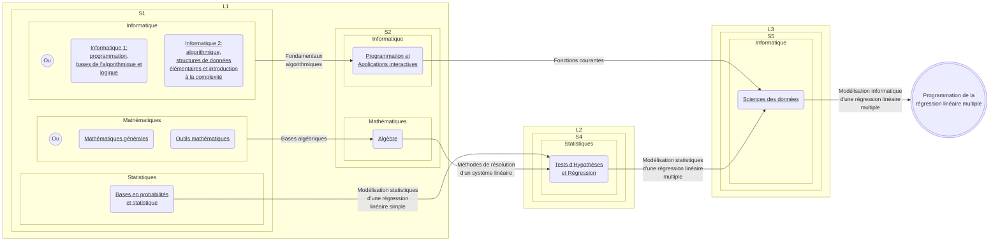

# Programmation de la Régression Linéaire Multiple (RLM)

```mermaid
flowchart LR
		subgraph le1[L1]
				subgraph se1[S1]
					subgraph stat1[Statistiques]
				    id1(<u> Bases en probabilités <br> et statistique </u>)
			    end
			    subgraph info1[Informatique]
				    id3((Ou))
				    id2(<u> Informatique 1: <br> programmation, <br> bases de l'algorithmique et <br> logique </u>)
				    id4(<u> Informatique 2: <br> algorithmique, <br> structures de données <br> élémentaires et introduction <br> à la complexité </u>)
			    end
			    subgraph math1 [Mathématiques]
						id6((Ou))
						id7(<u> Mathématiques générales </u>)
				    id5(<u> Outils mathématiques </u>)
					end
		    end
		    subgraph se2[S2]
			    subgraph math2[Mathématiques]
				    id8(<u> Algèbre </u>)
				  end
				  subgraph info2[Informatique]
					  id9(<u> Programmation et <br> Applications interactives </u>)
				  end
		    end
    end
    subgraph le2 [L2]
	    subgraph se4[S4]
		    subgraph stat2[Statistiques]
			    id10(<u> Tests d'Hypothèses <br> et Régression </u>)
			  end
			end
    end
    subgraph le3 [L3]
	    subgraph se5 [S5]
		    subgraph info3 [Informatique]
			    id11(<u> Sciences des données </u>)
			  end
			end
	  end
    id12@{ shape: dbl-circ, label: Programmation de la <br> régression linéaire multiple }
    %% clickable links
	    %% S1
	    click id1 "https://formations.u-bordeaux.fr/details-formation?type=enseignement&id=27784"
	    click id2 "https://formations.u-bordeaux.fr/details-formation?type=enseignement&id=38897"
	    click id4 "https://formations.u-bordeaux.fr/details-formation?type=enseignement&id=38899"
	    click id5 "https://formations.u-bordeaux.fr/details-formation?type=enseignement&id=38891"
	    click id7 "https://formations.u-bordeaux.fr/details-formation?type=enseignement&id=38892"
	    %% S2
	    click id8 "https://formations.u-bordeaux.fr/details-formation?type=enseignement&id=27954"
	    click id9 "https://formations.u-bordeaux.fr/details-formation?type=enseignement&id=27565"
	    %% S4
	    click id10 "https://formations.u-bordeaux.fr/details-formation?type=enseignement&id=73987"
	    %% S5
	    click id11 "https://formations.u-bordeaux.fr/details-formation?type=enseignement&id=28193"
	 %% knowledge transfer
		 id1 -- Modélisation statistiques <br> d'une régression <br> linéaire simple --> id10
		 info1 -- Fondamentaux <br> algorithmiques  --> id9
		 math1 -- Bases algébriques --> id8
		 id8 -- Méthodes de résolution <br> d'un système linéaire --> id10
		 id9 -- Fonctions courantes --> id11
		 id10 -- Modélisation statistiques <br> d'une régression linéaire <br> multiple --> id11
		 id11 -- Modélisation informatique <br> d'une régression linéaire <br> multiple --> id12
```