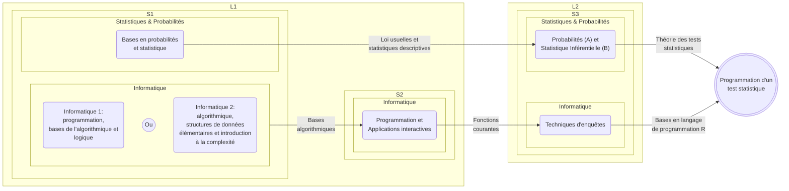

```mermaid
flowchart LR
		subgraph le1[L1]
				subgraph se1[S1]
					subgraph stat1[Statistiques]
				    id1(  Bases en probabilités <br> et statistique  )
			    end
			    subgraph info1[Informatique]
					id2(  Informatique 1: <br> programmation, <br> bases de l'algorithmique et <br> logique  )
				    id3((Ou))
				    id4(  Informatique 2: <br> algorithmique, <br> structures de données <br> élémentaires et introduction <br> à la complexité  )
			    end
			    subgraph math1 [Mathématiques]
         			id5(  Outils mathématiques  )
					id6((Ou))
					id7(  Mathématiques générales  )
					end
		    end
		    subgraph se2[S2]
			    subgraph math2[Mathématiques]
				    id8(  Algèbre  )
				  end
				  subgraph info2[Informatique]
					  id9(  Programmation et <br> Applications interactives  )
				  end
		    end
    end
    subgraph le2 [L2]
	    subgraph se4[S4]
		    subgraph stat2[Statistiques]
			    id10(  Tests d'Hypothèses <br> et Régression  )
			  end
			end
    end
    subgraph le3 [L3]
	    subgraph se5 [S5]
		    subgraph info3 [Informatique]
			    id11(  Sciences des données  )
			  end
			end
	  end
    id12@{ shape: dbl-circ, label: Programmation d'une <br> régression linéaire multiple }
    %% clickable links
	    %% S1
	    click id1 "https://formations.u-bordeaux.fr/details-formation?type=enseignement&id=27784"
	    click id2 "https://formations.u-bordeaux.fr/details-formation?type=enseignement&id=38897"
	    click id4 "https://formations.u-bordeaux.fr/details-formation?type=enseignement&id=38899"
	    click id5 "https://formations.u-bordeaux.fr/details-formation?type=enseignement&id=38891"
	    click id7 "https://formations.u-bordeaux.fr/details-formation?type=enseignement&id=38892"
	    %% S2
	    click id8 "https://formations.u-bordeaux.fr/details-formation?type=enseignement&id=27954"
	    click id9 "https://formations.u-bordeaux.fr/details-formation?type=enseignement&id=27565"
	    %% S4
	    click id10 "https://formations.u-bordeaux.fr/details-formation?type=enseignement&id=73987"
	    %% S5
	    click id11 "https://formations.u-bordeaux.fr/details-formation?type=enseignement&id=28193"
	 %% knowledge transfer
		 id1 -- Modélisation statistiques <br> d'une régression <br> linéaire simple --> id10
		 info1 -- Fondamentaux <br> algorithmiques  --> id9
		 math1 -- Bases algébriques --> id8
		 id8 -- Méthodes de résolution <br> d'un système linéaire --> id10
		 id9 -- Fonctions courantes --> id11
		 id10 -- Modélisation statistiques <br> d'une régression linéaire <br> multiple --> id11
		 id11 -- Modélisation informatique <br> d'une régression linéaire <br> multiple --> id12
```

# Des applications déjà possibles en Licence MIASHS
Vous trouverez dans cette section quelques exemples d'applications qu'il est possible de faire, avec les connaissances et compétences acquises au cours des années de la Licence.

## Programmation de la Régression Linéaire Multiple (RLM)

> [!NOTE]
> Sa réalisation nécessite la manipulation d'outils Mathématiques, Statistiques et Informatique.  
> La régression linéaire multiple permet d'estimer une variable quantitive à partir de variables explicant celle-ci.

### Diagramme des compétences à maitriser

### Exemple 
On cherche à déterminer le salaire d'un joueur de Basket en NBA en fonction de ses performances. 
Pour cela, on possède un tableau regroupant quelques statistiques sur des joueurs.  
**Voici un extrait du tableau :**  

| Nom           | Prénom     | Nationalité    | Moyenne de points par match  | Moyenne de rebonds captés par match  | Moyenne de passes décisives par match  | Score d'efficacité du joueur  | Salaire annuel (USD) |
| ------------- | ---------- | -------------- | ---- | ---- | ---- | ---- | -------------------- |
| Antetokounmpo | Giannis    | Grec           | 33.0 | 11.8 | 5.4  | 28.4 | 54 126 450 $         |
| Curry         | Stephen    | Américain      | 25.0 | 4.4  | 6.0  | 24.6 | 55 761 216 $         |
| James         | LeBron     | Américain      | 24.4 | 7.8  | 8.2  | 25.8 | 51 415 938 $         |
| Jokic         | Nikola     | Serbe          | 27.9 | 12.7 | 9.2  | 29.8 | 55 224 526 $         |
| Wembanyama    | Victor     | Français       | 22.4 | 10.8 | 3.6  | 21.7 | 12 160 800 $         |

Ainsi, la variable à estimer est `Salaire annuel (USD)`.

Les variables permettant d'expliquer le salaire sont : 
- `Moyenne de points par match`
- `Moyenne de rebonds captés par match `
- `Moyenne de passes décisives par match`
- `Score d'efficacité du joueur`

## Programmation de tests statistiques

> [!NOTE]
> Sa réalisation nécessite la manipulation d'outils Mathématiques, Probabilistes et Informatique.  
> Le test statistisque permet de trancher entre une hypothèse nulle (H0) et une hypothèse alternative (H1).

### Diagramme des compétences à maitriser

### Exemple
On cherche à savoir s'il existe une différence générationnelle dans la reconnaissance de style musicaux différents. 

**Pour cela, on réalise un blindtest évalué selon 3 conditions :** 
- Retrouver le titre de la musique parmi 54 références musicales
- Retrouver le nom de l'artiste parmi 50 références musciales
- Retrouver le titre et le nom de l'artiste parmi 80 références musciales

**3 groupes sont constitués :** 
- Groupe A (Etudiant)
- Groupe B (Actif)
- Groupe C (Retraité)

**Les hypothèses suivantes sont établies :** 
1. Le groupe A reconnaitra mieux les chansons que le groupe B et C 
2. Le groupe B et C reconnaitront de façon équivalente les chansons

**Voici les résultats obtenus :**

> [!IMPORTANT]
> - Les étoiles qui sont présentes sur le graphique désignent le niveau de significativité de la comparaison d'un groupe par rapport à un autre. En d'autres termes, plus il y a d'étoiles, plus la différence est forte entre les deux groupes comparés.   
> - L'intervalle que vous pouvez observé au niveau de chaque bar qui représente la moyenne, est un intervalle de confiance. Il permet de savoir dans le cas de cet intervalle, si la valeur observée se trouve bien dans la moyenne des valeurs recueillies. En d'autres termes, si la valeur observée ne se trouve pas dans cet intervalle, cela veut dire qu'elle ne fait pas partie des valeurs majoritairement observées.

**Pour la première hypothèse :**
On constate qu'il existe à chaque fois, une différence significative entre le groupe A et les autres groupes.   
Ce qui veut dire que l'hypothèse nulle globale (H0) selon laquelle il n'existe pas de différence entre le groupe A et les deux autres groupes est rejetée. On admet donc l'hypothèse alternative globale (H1) selon laquelle le groupe A est différent des deux autres groupes.  
Plus précisement, les différences sont plus marquées avec le groupe B que le groupe C.  
On peut conclure que l'hypothèse est validée.    

**Pour la deuxième hypothése :**
On constate alors, qu'il existe 2 fois sur 3, aucune différence significative entre les deux groupes.  
Pour le cas où la différence est présente, elle est sur le nombre de titres trouvés.  
Ce qui veut dire que l'hypothèse nulle globale (H0) selon laquelle il n'existe pas de différence entre le groupe B et C est admise. L'hypothèse alternative globale (H1) selon laquelle il existe une différence entre le groupe B et C est rejetée.  
On peut conclure que l'hypothèse est validée.

## Modélisation biomathématique

### Digramme des compétences à maitriser

### Exemple

On cherche à modéliser la transmission des gènes entre les abeilles.  
Pour cela, on s'appuit sur l'illustration suivante : 

Cette illustration est extraite d'un [article de revue](https://www.erudit.org/fr/revues/ms/2003-v19-n4-ms517/006497ar/) paru dans médecine sciences. 

Comme on peut le voir sur cette illustration, la reine transmet la moitié de ses chromosomes alors que le mâle lui, la totalité. 
Cela s'explique par le fait que le mâle est issu directement de la reine (pas de fécondation de l'oeuf par un mâle). Il ne possède que pour partrimoine génétique, la moitié des gènes de la reine. 
Ses chromosomes sont tous identfiques. 
Ce qui a pour conséquence, une diversité génétique très restreinte entre les mâles issu d'une même reine.    

On constacte que par ce procédé, on a des différences de transmission de gènes qui conduisent alors à des liens de parenté différencié selon le sexe.
En prennant l'exemple de la *Fille a* issu de la reine et du mâle, elle a 25 % de gènes en commun avec son frère (*Fils*) contre 75 % de gènes en commun avec sa soeur (*Fille b*). 
La *Fille b* a même plus de gènes en commun avec son neveu (37,5 % en commun) que son propre frère.    
Ce phénomène que l'on appelle la dillution génétique, est un comportement qu'adopte la reine afin de réguler sa descendance. 
En faisant cela, elle s'assure que ses filles s'occupent plutôt de leurs soeurs que de leur propre descendence. 
La reine garde ainsi le contrôle sur la distribution génétique entre les générations, et indirectement, protége son statut de reine. 
