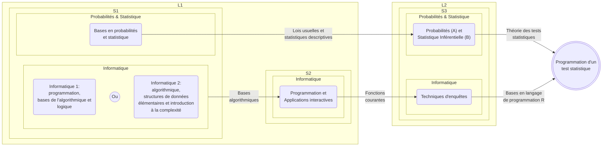

```mermaid
flowchart LR
		subgraph le1 [L1]
			subgraph se1 [S1]
				subgraph math1 [Mathématiques]
					id1( Outils mathématiques )
					id2((Ou))
					id3( Mathématiques générales )
		    	end
		    	subgraph info1 [Informatique]
					id4( Informatique 1: <br> programmation, <br> bases de l'algorithmique et <br> logique )
		    		id5((Ou))
			  		id6( Informatique 2: <br> algorithmique, <br> structures de données <br> élémentaires et introduction <br> à la complexité )
			  	end
	    end
	    subgraph se2[S2]
		    subgraph math2[Mathématiques]
			    id7( Analyse appliquée )
			    id8( Algèbre )
			  end
			  subgraph info2 [Informatique]
				  id9( Programmation et <br> Applications interactives )
				end
	    end
    end
    subgraph le2 [L2]
	    subgraph se3 [S3]
		    subgraph math3 [Mathématiques]
			    id10( Fonctions de plusieurs <br> variables et optimisation )
			  end
			end
		end
		subgraph le3 [L3]
			subgraph se5 [S5]
				subgraph math4 [Mathématiques]
					id11( Méthodes Numériques <br> Linéaires et Non linéaires )
				end
			end
			subgraph se6 [S6]
				subgraph math5 [Mathématiques]
					id12( Systèmes dynamiques et <br> Modélisation <br>  Biomathématique ) 
				end
			end
		end
		id13@{ shape: dbl-circ, label: Résolution de modèles <br> biomathématique }
		
    %% clickable link
	    %% S1
	    click id1 "https://formations.u-bordeaux.fr/details-formation?type=enseignement&id=38891"
	    click id3 "https://formations.u-bordeaux.fr/details-formation?type=enseignement&id=38892"
	    click id4 "https://formations.u-bordeaux.fr/details-formation?type=enseignement&id=38897"
	    click id6 "https://formations.u-bordeaux.fr/details-formation?type=enseignement&id=38899"
	    %% S2
	    click id7 "https://formations.u-bordeaux.fr/details-formation?type=enseignement&id=27957"
	    click id8 "https://formations.u-bordeaux.fr/details-formation?type=enseignement&id=27954"
	    click id9 "https://formations.u-bordeaux.fr/details-formation?type=enseignement&id=27565"
	    %% S3
	    click id10 "https://formations.u-bordeaux.fr/details-formation?type=enseignement&id=28020"
	    %% S5 
	    click id11 "https://formations.u-bordeaux.fr/details-formation?type=enseignement&id=77922"
	    %% S6
	    click id12 "https://formations.u-bordeaux.fr/details-formation?type=enseignement&id=77953"
    %% knowledge transfer
    math1 -- Base de l'analyse <br> des fonctions --> id7
    math1 -- Bases algébriques --> id8
    info1 -- Bases <br> algorithmiques  --> id9
    id7 -- Dérivations de fonctions --> id10
    id7 -- Suites numériques --> id12
    id8 -- Méthodes de résolution <br> d'un système linéaire --> id12
    id9 -- Fonction courantes --> id11
    id10 -- Dérivations partielles et <br> équations différentielles --> id12
    id11 -- Modélisation <br> mathématiques <br> et informatique --> id12
    id12 -- Méthodes pour modéliser <br> des phénomènes <br> biologiques --> id13
```

```mermaid
flowchart LR
		subgraph le1 [L1]
			subgraph se1 [S1]
				subgraph sc1 [Sciences Cognitives]
		    		id1( Introduction à la gestion <br> des organisations et <br> aux sciences cognitives )
		    	end
		    	subgraph info1 [Informatique]
                    id2( Informatique 1: <br> programmation, <br> bases de l'algorithmique et <br> logique )
					id3((Ou))
					id4( Informatique 2: <br> algorithmique, <br> structures de données <br> élémentaires et introduction <br> à la complexité )
               end
	    end
	    subgraph se2[S2]
			  subgraph info2 [Informatique]
				  id5( Programmation et <br> Applications interactives )
              end
	    end
    end
    subgraph le2 [L2]
	    subgraph se3 [S3]
		    subgraph sc2 [Sciences Cognitives]
			    id6( Bases de neurobiologie et <br> neuroanatomie, <br> fondamentaux cognitifs et <br> apprentissage )
			   end
			end
	    subgraph se4 [S4]
		    subgraph info3 [Informatique]
			    id7( Systèmes de gestion <br> de bases de données,<br> conception de sites <br> web dynamiques )
			  end
			end
		end
		subgraph le3 [L3]
			subgraph se6 [S6]
				subgraph sc3 [Sciences Cognitives]
					id8( Facteur Humain et <br> Ergonomie) 
				end
			end
		end
		subgraph mr1 [Master]
			subgraph sc4 [Sciences Cognitives]
				id9(Modélisation en <br> psychologie)
			end
			subgraph info4 [Informatique]
				id10(Technologies web avancées)
			end
		end
		id11@{ shape: dbl-circ, label: Création d'applications <br> ergonomiques}
		
    %% clickable link
	    %% S1
	    click id1 "https://formations.u-bordeaux.fr/details-formation?type=enseignement&id=27787"
	    click id2 "https://formations.u-bordeaux.fr/details-formation?type=enseignement&id=38892"
	    click id4 "https://formations.u-bordeaux.fr/details-formation?type=enseignement&id=38897"
	    %% S2
	    click id5 "https://formations.u-bordeaux.fr/details-formation?type=enseignement&id=27565"
	    %% S3
	    click id6 "https://formations.u-bordeaux.fr/details-formation?type=enseignement&id=27994"
	    %% S4
	    click id7 "https://formations.u-bordeaux.fr/details-formation?type=enseignement&id=52819"
	    %% S6
	    click id8 "https://formations.u-bordeaux.fr/details-formation?type=enseignement&id=77961"
    %% knowledge transfer
    info1 -- Bases <br> algorithmiques  --> id5
    id1 -- Base du traitement <br> de l'information --> id6
    id5 -- Fonctions courantes et <br> interface graphique --> id7
    id6 -- Composants cognitifs <br> impliqués dans <br> une tâche --> id8
    id7 -- Langage web et <br> gestion de <br> bases de données --> id10
    id8 -- Connaissances générales <br> sur l'ergonomie --> id9
    id9 -- Concepts fondamentaux <br> en ergonomie <br> des applications --> id11
    id10 -- Framework de <br> développement web <br> et application mobile --> id11
```

```mermaid
flowchart LR
		subgraph le1 [L1]
			subgraph se1 [S1]
				subgraph sc1 [Sciences Cognitives]
					id1( Introduction à la gestion <br> des organisations et <br> aux sciences cognitives )
				end
			    subgraph info1 [Informatique]
					id2( Informatique 1: <br> programmation, <br> bases de l'algorithmique et <br> logique )
				    id3((Ou))
					id4( Informatique 2: <br> algorithmique, <br> structures de données <br> élémentaires et introduction <br> à la complexité )
				end
				subgraph math1 [Mathématiques]
					id5( Outils mathématiques )
					id6((Ou))
					id7( Mathématiques générales )
				end
				subgraph proba1[Probabilités]
					id8( Bases en probabilités <br> et statistique )
				end
	    	end
		    subgraph se2[S2]
				subgraph info2 [Informatique]
				  id9( Programmation et <br> Applications interactives )
				end
				subgraph math2[Mathématiques]
					id10( Algèbre )
					id11( Analyse appliquée )
				end
	    	end
    	end
	    subgraph le2 [L2]
		    subgraph se3 [S3]
			    subgraph sc2 [Sciences Cognitives]
				    id12( Bases de neurobiologie et <br> neuroanatomie, <br> fondamentaux cognitifs et <br> apprentissage )
				   end
				  subgraph math3 [Mathématiques]
					  id13( Séries et <br> intégrales multiples )
					  id14( Fonctions de plusieurs <br> variables et optimisation )
					end
					subgraph proba2 [Probabilités]
						id15( Probabilités #0040;A#0041; et <br> Statistique Inférentielle #0040;B#0041; )
					end
				end
	    subgraph se4 [S4]
			  subgraph sc3 [Sciences Cognitives]
				  id16( Perception, action, <br> mémoire et <br> fonctions exécutives )
				end
				subgraph math4 [Mathématiques]
					id17( Algèbre 2 #0040;A#0041; et <br> Espaces Euclidiens #0040;B#0041; )
				end
			end
		end
		subgraph le3 [L3]
			subgraph se5 [S5]
				subgraph sc4 [Sciences Cognitives]
					id18( Neuropsychologie, <br> neuropathologie <br> et imagerie cérébrale )
				end
				subgraph math5 [Mathématiques]
					id19( Méthodes Numériques <br> Linéaires et <br> Non linéaires )
				end
				subgraph info3 [Informatique]
					id20( Apprentissage machine <br> et Imagerie numérique )
				end
		end
		  subgraph se6 [S6]
				subgraph sc5 [Sciences Cognitives]
					id21( Psychophysiologie, <br> Neuroergonomie <br> / Traitement du Signal <br> et Neurosciences <br> Computationnelles ) 
					id22( Connaissances et <br> représentations, <br> langage et TAL )
				end
				subgraph proba3 [Probabilités]
					id23( Processus Aléatoires <br> et Séries Chronologiques </ul>)
				end
				subgraph math6 [Mathématiques]
					id24( Systèmes dynamiques <br> et Modélisation <br> Biomathématique </ul>)
				end
		  end
		end
		subgraph mr1 [Master]
			subgraph info4 [Informatique]
				id25(Interfaces <br> Cerveau-Ordinateur)
				id26(Réseaux de neurones)
			end
		end
		id27@{shape: dbl-circ, label: Création d'une interface <br> cerveau ordinateur}
		
    %% clickable link
	    %% S1
	    click id1 "https://formations.u-bordeaux.fr/details-formation?type=enseignement&id=27787"
	    click id2 "https://formations.u-bordeaux.fr/details-formation?type=enseignement&id=38892"
	    click id4 "https://formations.u-bordeaux.fr/details-formation?type=enseignement&id=38897"
	    click id5 "https://formations.u-bordeaux.fr/details-formation?type=enseignement&id=38891"
	    click id7 "https://formations.u-bordeaux.fr/details-formation?type=enseignement&id=38892"
	    click id8 "https://formations.u-bordeaux.fr/details-formation?type=enseignement&id=27784"
	    %% S2
	    click id9 "https://formations.u-bordeaux.fr/details-formation?type=enseignement&id=27565"
	    click id10 "https://formations.u-bordeaux.fr/details-formation?type=enseignement&id=27954"
	    click id11 "https://formations.u-bordeaux.fr/details-formation?type=enseignement&id=27957"
	    %% S3
	    click id12 "https://formations.u-bordeaux.fr/details-formation?type=enseignement&id=27994"
	    click id13 "https://formations.u-bordeaux.fr/details-formation?type=enseignement&id=28115"
		click id14 "https://formations.u-bordeaux.fr/details-formation?type=enseignement&id=28035"
	    click id15 "https://formations.u-bordeaux.fr/details-formation?type=enseignement&id=27578"
	    %% S4
	    click id16 "https://formations.u-bordeaux.fr/details-formation?type=enseignement&id=77959"
	    click id17 "https://formations.u-bordeaux.fr/details-formation?type=enseignement&id=77922"
	    %% S5
	    click id18 "https://formations.u-bordeaux.fr/details-formation?type=enseignement&id=77963"
	    click id19 "https://formations.u-bordeaux.fr/details-formation?type=enseignement&id=77922"
	    click id20 "https://formations.u-bordeaux.fr/details-formation?type=enseignement&id=77923"
	    %%S6
	    click id21 "https://formations.u-bordeaux.fr/details-formation?type=enseignement&id=77963"
	    click id23 "https://formations.u-bordeaux.fr/details-formation?type=enseignement&id=77951"
	    click id22 "https://formations.u-bordeaux.fr/details-formation?type=enseignement&id=77957"
	    click id24 "https://formations.u-bordeaux.fr/details-formation?type=enseignement&id=77953"
    %% knowledge transfer
    info1 -- Bases <br> algorithmiques  --> id9
    math1 -- Bases <br> algébriques --> id10
    math1 -- Base de l'analyse <br> de fonctions --> id11
    id1 -- Base du traitement <br> de l'information --> id12
    id8 -- Lois uselles --> id15
    id9 -- Fonctions courantes et <br> interface graphique --> id20
    id12 -- Composants cognitifs <br> impliqués dans <br> une tâche --> id16
    id11 -- Base de <br> l'integration --> id13
    id11 -- Base de <br> la dérivation --> id14
    id10 -- Méthodes de résolution <br> d'un système <br> linéaire --> id17
    id14 -- Dérivation partielle --> id19
    id17 -- Caractéristiques <br> d'un système <br> linéaire --> id19
    id19 -- Méthodes de résolution <br> numérique --> id24
    id24 -- Stabilité d'un système --> id26
    id16 -- Processus cognitifs <br> à l'oeuvre <br> pour différentes <br> conditions --> id18
    id18 -- Base de l'anayse <br> cérébrale <br> pathologique et <br> non pathologique --> id21
    id13 -- Analyse avancée <br> d'intégrales et <br> de séries --> id21
    info1 -- Base de la <br> logique --> id22
    id22 -- Base du traitement <br> d'un réseau <br> de neurones <br> artificielles --> id26
    id21 -- Interprétation des <br> résultats du réseau <br> de neurones --> id25
    id26 -- Classification des <br> signaux éléctriques <br> cérébraux --> id25
    id15 -- Variables aléatoires --> id23
    id23 -- Processus stochastiques --> id26
    id20 -- Transformations <br> des données --> id26
    id25 -- Méthodes numériques <br> d'analyse de l'activité électrique cérébrale --> id27
    id21 -- Traitement des signaux électriques <br> cérébraux --> id26
```

```mermaid
flowchart LR
		subgraph le1 [L1]
			subgraph se1 [S1]
				subgraph ecog1 [Eco-gestion]
					id1(Introduction à la gestion des organisations et aux sciences cognitives)
	            end
				subgraph statproba1[Probabilités & Statistique]
					id2(Bases en probabilités et statistique)
				end
				subgraph math1 [Mathématiques]
         			id3(Outils mathématiques)
					id4((Ou))
					id5(Mathématiques générales)
				end
				subgraph info1 [Informatique]
					id6(Informatique 1: programmation, bases de l'algorithmique et logique )
				    id7((Ou))
					id8( Informatique 2: algorithmique, structures de données élémentaires et introduction à la complexité )
			    end
			end
			subgraph se2 [S2]
				subgraph ecog2 [Eco-gestion]
					id9(Introduction aux sciences économiques)
				end
				subgraph info2 [Informatique]
				  	id10(Programmation et Applications interactives)
				end
				subgraph math2 [Mathématiques]
					id11(Analyse appliquée)
				end
			end
		end
		subgraph le2 [L2]
			subgraph se3 [S3]
				subgraph statproba2 [Probabilités & Statistique]
					id12(Probabilités #0040;A#0041; et Statistique Inférentielle #0040;B#0041;)
				end
				subgraph math3 [Mathématiques]
				  id13(Séries et intégrales multiples)
				end
				subgraph info3 [Informatique]
					id14(Techniques d'enquêtes) 
				end
				subgraph ecog3 [Eco-gestion]
					id15(Techniques Comptables)
				end
			end
			subgraph se4 [S4]
				subgraph info4 [Informatique]
					id16(Systèmes de gestion de bases de données, conception de sites web dynamiques)
				end
				subgraph stat1 [Statistique]
					id17(Tests d'Hypothèses et Régression)
				end
				subgraph egcog4 [Eco-gestion]
					id18(Initiation au Droit de l'entreprise)
				end
			end
		end
		subgraph le3 [L3]
			subgraph se5 [S5]
				subgraph ecog5 [Eco-gestion]
					id19(Santé publique)
				end
			end
			subgraph se6 [S6]
				subgraph ecog6 [Eco-gestion]
					id20(Gestion responsable des Ressources Humaines)
				end
				subgraph math4 [Mathématiques]
					id21(Processus Aléatoires et Séries Chronologiques)
				end
			end
		end
		subgraph mr1 [Master]
			subgraph ecog7 [Eco-gestion]
				id22(Conception et développement)
				id23(Analyse fonctionnelle et cahier des charges)
			end
		end
		id24@{shape: dbl-circ, label: Mener un projet}
		%% clickable links
			%% S1
			click id1 "https://formations.u-bordeaux.fr/details-formation?type=enseignement&id=27787"
			click id2 "https://formations.u-bordeaux.fr/details-formation?type=enseignement&id=27784"
			click id3 "https://formations.u-bordeaux.fr/details-formation?type=enseignement&id=38891"
	    	click id5 "https://formations.u-bordeaux.fr/details-formation?type=enseignement&id=38892"
			click id6 "https://formations.u-bordeaux.fr/details-formation?type=enseignement&id=38892"
	    	click id8 "https://formations.u-bordeaux.fr/details-formation?type=enseignement&id=38897"
			%% S2
			click id9 "https://formations.u-bordeaux.fr/details-formation?type=enseignement&id=27924"
			click id10 "https://formations.u-bordeaux.fr/details-formation?type=enseignement&id=27565"
			%% S3
			click id11 "https://formations.u-bordeaux.fr/details-formation?type=enseignement&id=27957"
			click id12 "https://formations.u-bordeaux.fr/details-formation?type=enseignement&id=27578"
			click id13 "https://formations.u-bordeaux.fr/details-formation?type=enseignement&id=28115"
			click id14 "https://formations.u-bordeaux.fr/details-formation?type=enseignement&id=28124"
			click id15 "https://formations.u-bordeaux.fr/details-formation?type=enseignement&id=73949"
			%% S4
			click id16 "https://formations.u-bordeaux.fr/details-formation?type=enseignement&id=52819"
			click id17 "https://formations.u-bordeaux.fr/details-formation?type=enseignement&id=73987"
			click id18 "https://formations.u-bordeaux.fr/details-formation?type=enseignement&id=28032"
			%% S5
			click id19 "https://formations.u-bordeaux.fr/details-formation?type=enseignement&id=77929"
			%% S6
			click id20 "https://formations.u-bordeaux.fr/details-formation?type=enseignement&id=77947"
			click id21 "https://formations.u-bordeaux.fr/details-formation?type=enseignement&id=77951"
		%% knowledge tranfer
		id1 -- Cadre d'une organisation --> id18
		id2 -- Lois usuelles et statistiques descriptives --> id12
		math1 -- Base de l'analyse de fonctions --> id11
		info1 -- Bases algorithmiques --> id10
		id9 -- Courants économiques --> id23
		id10 -- Fonctions courantes --> id16
		id11 -- Base de l'intégration --> id13
		id12 -- Théorie des tests statistiques --> id17
		id13 -- Analyse avancée d'intégrales et de séries --> id21
		id14 -- Méthodes d'analyses quantitatives et qualitatives --> id22
		id14 -- Méthodes d'investigations --> id19
		id15 -- Calcul d'un budget --> id23
		id16 -- Langage web et gestion de bases de données --> id22
		id17 -- Modélisations statistiques --> id22
		id18 -- Base de la réglementation des entreprises --> id20
		id19 -- Politiques publiques et interventions adpatées --> id22
		id20 -- Techniques de gestion du personnel --> id22
		id21 -- Analyse avancée des évolutions au <br> cours du temps --> id23
		id22 -- Processus du projet --> id24
		id23 -- Préparation du projet --> id24
```

```mermaid
flowchart LR
		subgraph le1 [L1]
			subgraph se1 [S1]
			    subgraph info1 [Informatique]
					id2( Informatique 1: <br> programmation, <br> bases de l'algorithmique et <br> logique )
				    id3((Ou))
					id4( Informatique 2: <br> algorithmique, <br> structures de données <br> élémentaires et introduction <br> à la complexité )
				end
				subgraph math1 [Mathématiques]
					id5( Outils mathématiques )
					id6((Ou))
					id7( Mathématiques générales )
				end
				subgraph probastat1[Probabilités & statistique]
					id8( Bases en probabilités <br> et statistique )
				end
			end
		    subgraph se2[S2]
				subgraph info2 [Informatique]
					id9( Programmation et <br> Applications interactives )
				end
				subgraph math2[Mathématiques]
				  id10( Algèbre )
				end
	    	end
		end
	    subgraph le2 [L2]
		    subgraph se3 [S3]
				subgraph probastat2 [Probabilités & statistique]
					id15( Probabilités #0040;A#0041; et <br> Statistique Inférentielle #0040;B#0041; )
				end
			end
			subgraph se4 [S4]
				subgraph probastat3 [Probabilités & Statistique]
						id17(Tests d'Hypothèses et Régression)
				end
			end
		end
		subgraph le3 [L3]
			subgraph se5 [S5]
				subgraph info3 [Informatique]
					id20( Apprentissage machine <br> et Imagerie numérique )
					id21( Sciences des données )
				end
			end
		end
		subgraph mr1 [Master]
			subgraph info4 [Informatique]
				id25(Traitement de données)
				id26(Fouille de données)
			end
		end
		id27@{shape: dbl-circ, label: Mise en place d'une analyse des données}
		
    %% clickable link
	    %% S1
	    click id2 "https://formations.u-bordeaux.fr/details-formation?type=enseignement&id=38892"
	    click id4 "https://formations.u-bordeaux.fr/details-formation?type=enseignement&id=38897"
	    click id5 "https://formations.u-bordeaux.fr/details-formation?type=enseignement&id=38891"
	    click id7 "https://formations.u-bordeaux.fr/details-formation?type=enseignement&id=38892"
	    click id8 "https://formations.u-bordeaux.fr/details-formation?type=enseignement&id=27784"
	    %% S2
	    click id9 "https://formations.u-bordeaux.fr/details-formation?type=enseignement&id=27565"
	    click id10 "https://formations.u-bordeaux.fr/details-formation?type=enseignement&id=27954"
	    %% S3
	    click id15 "https://formations.u-bordeaux.fr/details-formation?type=enseignement&id=27578"
	    %% S4
	    click id17 "https://formations.u-bordeaux.fr/details-formation?type=enseignement&id=73987"
	    %% S5
	    click id20 "https://formations.u-bordeaux.fr/details-formation?type=enseignement&id=77923"
		click id21 "https://formations.u-bordeaux.fr/details-formation?type=enseignement&id=28193"
    %% knowledge transfer
    info1 -- Bases <br> algorithmiques  --> id9
    math1 -- Bases <br> algébriques --> id10
    id8 -- Lois uselles et statistiques descriptives --> id15
    id9 -- Fonctions courantes --> id20
    id10 -- Méthodes de résolution <br> d'un système <br> linéaire --> id20
	id15 -- Variables aléatoires et théories des tests statistiques --> id17
	id17 -- Modélisations statistiques et probabilistes --> id21
    id20 -- Transformations <br> des données --> id25 
	id20 -- Techniques d'extraction de caractéristiques --> id26
	id21 -- Modélisations numériques --> id27
	id25 -- Préparation des données --> id27
	id26 -- Découverte de caractéristiques cachés --> id27
```

# Des applications déjà possibles en Licence MIASHS
Vous trouverez dans cette section quelques exemples d'applications qu'il est possible de faire, avec les connaissances et compétences acquises au cours des années de la Licence.

## Programmation de la Régression Linéaire Multiple (RLM)

> [!NOTE]
> Sa réalisation nécessite l'utilisation d'outils mathématiques, statistiques et informatiques.  
> La régression linéaire multiple permet d'estimer une variable quantitative à partir de variables expliquant celle-ci.

### Diagramme des connaissances et compétences clés à mobiliser

### Exemple 
On cherche à déterminer le salaire d'un joueur de basket en NBA en fonction de ses performances. 
Pour cela, on possède un tableau regroupant quelques statistiques sur des joueurs.  
**Voici un extrait du tableau :**  

| Nom           | Prénom     | Nationalité    | Moyenne de points par match  | Moyenne de rebonds captés par match  | Moyenne de passes décisives par match  | Score d'efficacité du joueur  | Salaire annuel (USD) |
| ------------- | ---------- | -------------- | ---- | ---- | ---- | ---- | -------------------- |
| Antetokounmpo | Giannis    | Grec           | 33.0 | 11.8 | 5.4  | 28.4 | 54 126 450 $         |
| Curry         | Stephen    | Américain      | 25.0 | 4.4  | 6.0  | 24.6 | 55 761 216 $         |
| James         | LeBron     | Américain      | 24.4 | 7.8  | 8.2  | 25.8 | 51 415 938 $         |
| Jokic         | Nikola     | Serbe          | 27.9 | 12.7 | 9.2  | 29.8 | 55 224 526 $         |
| Wembanyama    | Victor     | Français       | 22.4 | 10.8 | 3.6  | 21.7 | 12 160 800 $         |

Ainsi, la variable à estimer est `Salaire annuel (USD)`.

Les variables permettant d'expliquer le salaire sont : 
- `Moyenne de points par match`
- `Moyenne de rebonds captés par match `
- `Moyenne de passes décisives par match`
- `Score d'efficacité du joueur`

## Programmation de tests statistiques

> [!NOTE]
> Sa réalisation nécessite l'utilisation d'outils mathématiques, statistiques, probabilistes et informatiques.  
> Le test statistique permet de trancher entre une hypothèse nulle (H0)[^1] et une ou des hypothèses alternatives (HA)[^2].

### Diagramme des connaissances et compétences clés à mobiliser

### Exemple
On cherche à savoir s'il existe une différence générationnelle dans la reconnaissance de styles musicaux différents. 

**Pour cela, on réalise un blindtest évalué selon 3 conditions :** 
- Retrouver le titre de la musique parmi 54 références musicales
- Retrouver le nom de l'artiste parmi 50 références musicales
- Retrouver le titre et le nom de l'artiste parmi 80 références musicales

**3 groupes sont constitués :** 
- Groupe A (Etudiant)
- Groupe B (Actif)
- Groupe C (Retraité)

**Les hypothèses suivantes sont établies :** 
1. Le groupe A reconnaitra mieux les chansons que le groupe B et C 
2. Le groupe B et C reconnaitront de façon équivalente les chansons

**Voici les résultats obtenus :**

> [!TIP]
> - Les étoiles qui sont présentes sur le graphique désignent le niveau de signification[^3] de la comparaison d'un groupe par rapport à un autre. En d'autres termes, plus il y a d'étoiles, plus la différence est forte entre les deux groupes comparés. Dernier point, *ns* signifie non significatif, c'est à dire qu'aucun lien statistique significatif n'a été trouvé entre les groupes d'après le test effectué.   
> - L'intervalle que vous pouvez observée au niveau de chaque bar qui représente la moyenne, est un intervalle de confiance. Il permet de savoir dans le cas de cet intervalle, si la valeur observée se trouve bien dans la moyenne des valeurs recueillies. En d'autres termes, si la valeur observée ne se trouve pas dans cet intervalle, cela veut dire qu'elle ne fait pas partie des valeurs majoritairement observées.

	
 <strong> Pour la première hypothèse </strong>  

On constate qu'il existe à chaque fois, une différence significative entre le groupe A et les autres groupes.   
Ce qui veut dire que l'hypothèse selon laquelle il n'existe pas de différence entre le groupe A et les deux autres groupes (H0) est rejetée. On admet donc l'hypothèse selon laquelle le groupe A est différent des deux autres groupes (H1).  
Plus précisément, les différences sont plus marquées avec le groupe B que le groupe C.  
On peut conclure que la première hypothèse est validée.    

	
 <strong> Pour la deuxième hypothèse  </strong> 

On constate alors qu'il existe 2 fois sur 3, aucune différence significative entre les deux groupes.  
Pour le cas où la différence est présente, elle est sur le nombre de titres trouvés.  
Ce qui veut dire que l'hypothèse selon laquelle il n'existe pas de différence entre le groupe B et C (H0) est admise. L'hypothèse selon laquelle il existe une différence entre le groupe B et C (H1) est rejetée.  
On peut conclure que la deuxième hypothèse est validée.

[^1]: Elle stipule que l'on ne peut pas mettre en évidence un lien (exemple : l'employé n'a pas fraudé (H0)).
[^2]: Cela désigne une ou des hypothèses qui stipulent qu'il existe un lien (exemple : l'employé a détourné des fonds de l'entreprise (H1), l'employé a placé de l'argent dans des paradis fiscaux (H2)).
[^3]: C'est la valeur seuil à partir de laquelle on peut qualifier la force du lien.

## Modélisation biomathématique
> [!NOTE]
> Sa réalisation nécessite l'utilisation d'outils mathématiques, informatiques et de notions en biologie.  
> Elle permet de représenter des phénomènes biologiques sous une forme quantifiable afin d'extraire des informations complémentaires.
### Diagramme des connaissances et compétences clés à mobiliser

### Exemple

On cherche à modéliser la transmission des gènes entre les abeilles.  
Pour cela, on s'appuie sur l'illustration suivante : 

Cette illustration est extraite d'un [article de revue](https://www.erudit.org/fr/revues/ms/2003-v19-n4-ms517/006497ar/) paru dans médecine sciences. 

Comme on peut le voir sur cette illustration, la reine transmet la moitié de ses chromosomes alors que le mâle lui, la totalité. Cela s'explique par le fait que le mâle est issu directement de la reine (pas de fécondation de l'oeuf par un mâle). Il ne possède, pour patrimoine génétique, que la moitié des gènes de la reine. Ses chromosomes sont tous identiques. Ce qui a pour conséquence, une diversité génétique plus restreinte entre les mâles issus d'une même reine.

On constate qu'il y a des différences de transmission de gènes qui conduisent alors, à des liens de parenté selon le sexe. En prenant l'exemple de la *Fille a* issu de la reine et du mâle, elle a 25 % de gènes en commun avec son frère (*Fils*) contre 75 % de gènes en commun avec sa soeur (*Fille b*). La *Fille b* a même plus de gènes en commun avec son neveu (37,5 %) que son propre frère (25 %).

Ce phénomène, que l'on appelle la dilution génétique, est un comportement qu'adopte la reine afin de réguler sa descendance. En faisant cela, la reine s'assure que ses filles s'occupent plutôt de sa propre descendance (leurs soeurs) que de la leur. La reine garde ainsi le contrôle sur la distribution génétique entre les générations, et indirectement, protège son statut de reine. 

# Les applications possibles en poursuivant en Master
Vous trouverez dans cette section quelques exemples d'applications qu'il est possible de faire, avec les connaissances et compétences acquises au cours des années de la Licence et du Master.
## Ergonomie des applications
> [!NOTE]
> Sa mise en oeuvre nécessite l'utilisation d'outils informatiques et de connaissances spécifiques en sciences cognitives[^4].  
> Elle permet d'évaluer et d'améliorer les interactions entre les utilisateurs et les ordinateurs, en se basant sur la cognition humaine[^5].
[^4]: Elles sont impliquées dans la description, l'explication et quand cela le nécessite, dans la simulation des principales dispositions et capacités de l'esprit humain (comme le langage, le raisonnement, la perception, la coordination motrice, la planification, ...).
[^5]: C'est l'ensemble des processus psychologiques et physiologiques qui permettent à un individu d'avoir une connaissance de son environnement et de lui-même.
### Diagramme des connaissances et compétences clés à mobiliser

### Exemple

Une entreprise fait appel à nos services afin d'améliorer son expérience utilisateur[^6].
Elle souhaite que nous lui fassions un retour sur les différentes nouveautés qu'elle pourrait inclure pour compléter son offre déjà existante.    
Pour cela, nous commençons par analyser les applications déjà disponibles sur le marché.  
Voici l'une des applications analysées : 

Cette analyse se fait selon 3 axes : 
- Le design[^7]
- La navigation[^8]
- Les fonctionnalités[^9]

**Pour le design :** 

	

 + 

- Lisibilité des informations de suivi (prise de médicaments, espacement des crises, ...) et de celles à renseigner (ajout ou modification du traitement, d'une crise, ...)
- Représentation graphique épurée (visibilité des crises sur la semaine, le mois ou l'année)  
  

	
 - 

	
- Bouton pour accéder aux graphiques plus détaillés un peu grossier (sur l'écran d'accueil)
- Impression d'une liste interminable (sur l'écran paramètres)

**Pour la navigation :** 

	

 + 

Fluidité de passage entre les différents éléments de l'écran (pour ajouter, modifier ou consulter des traitements, ...)
  

	
 - 

- Avoir la possibilité de revenir automatiquement sur le jour actuel si on change d'écran (sur l'écran journal)
- Devoir swiper vers le haut ou le bas longtemps pour accéder à une date éloignée (sur l'écran journal)

**Pour les fonctionnalités :** 

	

 + 

- Affichage de représentations graphiques compréhensibles (crises survenues dans la semaine, humeurs, ...)
- Gestion de tous les événements courants (traitement, crise, note, effet secondaire, rendez-vous, rappels)
- Gestion de l'application (compte, notifications et assitance)
- Gestion d'un bracelet connecté pour détecter les crises nocturnes
  

	
 - 

- Renseigner la cause d'un effet secondaire (sur l'écran journal)
- Avoir la possibilité de revenir en arrière si on s'est trompé

[^6]: Elle désigne l'interaction entre un utilisateur (qui a des attentes, des besoins, ...), un système (qui a des fonctionnalités, une esthétique, ...) et un contexte (utilisation du système à la maison, au travail, ...).
[^7]: Il fait référence aux différents éléments visuels qui composent l'application (la mise en page, l'équilibre des couleurs, la cohérence graphique, ...).
[^8]: Il désigne la manière dont l'utilisateur parcours les différents contenus de l'application (le menu, les listes déroulantes, les boutons, ...).
[^9]: Elles se définissent comme les différentes actions qui sont intégrées dans l'application (ajouter, supprimer, modifier, ...).

## Interface Cerveau Ordinateur (ICO)
> [!NOTE]
> Sa réalisation nécessite des outils mathématiques, probabilistes et informatiques mais également des connaissances spécifiques en sciences cognitives[^4]. 
> Il permet d'améliorer ou d'explorer des fonctions du système nerveux central[^10] afin d'assurer principalement le contrôle et la communication.

### Diagramme des connaissances et compétences clés à mobiliser

### Exemple
On cherche à concevoir de nouvelles technologies qui pourraient aider les enfants ayant des Troubles de l'Attention avec ou sans Hyperactivité (TDA/H)[^11]. 
Pour cela, on fait une analyse des technologies déjà développées pour ce type de pratique et on interroge un panel d'enfants pour vérifier leurs besoins.
On teste nos différentes versions auprès des enfants. 

On aboutit au final à une application mobile où l'enfant pourra soit choisir un jeu parmi ceux proposés, soit créer son propre jeu. 
La création de son propre jeu reposera sur des thématiques de jeu déjà existantes, qui seront personnalisées selon les demandes de l'enfant. 
Ces demandes pourront se faire à l'écrit ou à l'oral. Un modèle d'IA générative conçu par nos soins, se chargera de rendre réalisable, les requêtes des enfants. 

Voici le schéma expérimental que nous avons mis en place :

Détails des étapes :

 
Cette première étape consiste à récupérer l'ensemble des informations qui serviront à analyser le comportement (c'est à dire, ce qui est transmis par la tablette, représenté par la flèche <strong> Etat du jeu </strong> sur notre schéma ; exemples : temps pour réaliser une action, choix des équipements, réussite de la mission,  ...) et le cerveau (c'est à dire, ce qui est transmis par le casque, représenté par la flèche <strong> Activité électrique du cerveau </strong> sur notre schéma ; exemple : signaux électriques de différentes régions du cerveau) de l'enfant.
  

Les informations ainsi recueillies par la box internet vont être envoyées en temps réel sur un serveur qui va traiter les données.   
Ce sont principalement les informations liées à l'activité électrique du cerveau qui vont suivre ce traitement : 

	
<strong>Amplifier</strong>

Les signaux électriques provenant de l'activité du cerveau vont être amplifiés de façon à les rendre exploitables (ils arrivent avec une faible intensité électrique).

	
<strong>Filtrer</strong>

Les signaux électriques vont être épurés de manière à ne conserver que le signal qui est utile à exploiter (exemples : suppression des bruits parasites comme les petits mouvements de la tête, isoler une partie de la fréquence que l'on souhaite étudier, ...).

	
<strong>Classifier</strong>

Les signaux alors obtenus vont être comparés à de précédents signaux afin de déduire le niveau de vigilance du joueur.

	
<strong>Contrôler</strong>

Le niveau de vigilance déduit après ces traitements et l'analyse des actions du joueur, vont amener à l'application de règles.

 

Une fois celles-ci établies, elles vont être transférées via internet. La boxe internet à son tour, va relayer les instructions. Elles vont avoir pour conséquence de modifier ou non le jeu.  

	
<strong>Exemples</strong>

**Si le joueur est moins attentif :** des actions du personnage ne pourront pas être faites.

**Si le joueur est trop impusif :** des actions du personnage seront ralenties.

 

Les retours pourront se faire sous forme de messages et de modifications du comportement du personnage. 

	
<strong>Exemples</strong>

**Pour un joueur moins attentif :** un message motivant, un affichage de chaque effort de concentration et une amélioration de l'action du personnage.

**Pour un joueur trop impulsif :** un message d'apaisement, un affichage de chaque effort pour se ramener à une concentration optimale et une amélioration de l'efficacité du personnage.

[^10]: Elles permettent de contrôler et de réguler (exemples : les mouvements, le langage, la vision, les sensations, ...).
[^11]: Ils se caractérisent par le développement inégaux de niveaux d'inattention, d'hyperactivité et d'impulsivité.

## Gestion de projet
> [!NOTE]
> Sa mise en partique nécessite des outils mathématiques, informatiques, statistiques et probabilistes ainsi que, des connaissances spécifiques en économie-gestion[^12]. 
> Elle permet de définir un processus pour coordonner, gérer et planifier le développement d'un projet.

[^12]: C'est une discipline qui étudie le monde économique et la gestion des organisations, utile aussi bien à l'échelle macroéconomique (Etat,marchés) qu'au niveau microéconomique (entreprises, individus).
### Diagramme des connaissances et compétences clés à mobiliser

### Exemple
Une entreprise fait appel à nos services pour lui développer un site web sur la vente de patisseries haut de gamme en ligne.  
Voici une manière d'organiser ce projet :    

On commence tout d'abord par une présentation de l'équipe :

<strong>Développeur front-end</strong>

	
Il est spécialisé dans la partie visible par l'utilisteur,  ce qui s'affiche à l'écran et les interactions (interfaces, graphismes, navigation, animations, ...).

<strong>Développeur back-end</strong>

	
Il est spécialisé sur la partie invisible, la gestion des serveurs, des bases de données, la logique métier, la sécurité et les performances de l'application.

<strong>Développeur full stack</strong>

	
Il est capable à la fois de faire du développement front-end et back-end. Ce qui veut dire, qu'il maitrise toute le processus de développement technique, de la conception de l'interface utilisteur à la gestion des données et des serveurs.

<strong>Analyste de marché</strong>

	
Il est chargé de collecter, analyser et interpréter des données relatives à un marché, à la concurrence et aux consomateurs. Cela pour founir des recommandations stratégiques à une entreprise ou une organisation.

<strong>Chef de projet</strong>

Il est chargée de coordonner, piloter et gérer la réalisation de projets pour une entreprise ou une organisation, de la conception jusqu'au déploiement final.

<strong>UX designer</strong>

	
De son nom développé User eXperience designer, il conçoit et optimise l'expérience utilisateur[^6] d'un produit ou d'un service numérique, en s'appuyant sur les besoins, les attentes et les comportements des utilisateurs.

<strong>UI designer</strong>

	
De son nom développé User Interface designer, il conçoit l'interface visuelle d'un produit numérique telle que, une application, un site web ou un logiciel.

> [!TIP]
> Pour mieux comprendre cette planification, il faut savoir que chaque membre de l'équipe est affecté à plusieurs projets en même temps ayant des niveaux d'avancements hétérogènes.
> L'entreprise employant des profils très spécifiques (souvent avec des rémunérations élevées) doit utiliser leurs compétences et leurs efficacités, afin de rentabiliser ses investissements.
> Cela lui permet également de proposer des offres sur mesure à ses clients, dans des délais raisonnables.

On va décortiquer les différentes étapes du projet : 

<strong>1. Recherche et construction d'une première ébauche du site web</strong>
	
	
**Durée :** elle s'étale sur 1 semaine (du **15 au 19 janvier**).

**Description :** elle consite à étudier les différentes opportunités du marché (`Etude de marché`) et concevoir une première version du système de vente (`Conception UML`).

<strong>2. Elaboration de la base du site web</strong>
	
	
**Durée :** elle s'étale sur 1 semaine (du **22 au 26 janvier**).

**Description :** elle consiste à se baser sur la première ébauche en l'améliorant. Pour cela, un examen plus spécifique du marché (`Etude de marché`) mais également, une délimitation précise des besoins des clients et des utilisateurs du site web (`Analyse des besoins`). Une deuxième version du système de vente est alors établie (`Conception UML`).

<strong>3. Conception d'une maquette du site web</strong>
	

**Durée :** elle s'étale sur 1 semaine (du **29 janvier au 2 février**).

**Description :** elle consiste à créer un modèle structurel (`Création d'une base de données`) et visuel (`Conception de l'interface`) du site, en se référent à la deuxième version du système de vente. Dans le même temps, des partenariats et des sous-traitances sont cherchés (`Affilation avec les partenaires & sous-traitant`) afin pour l'un, de développer les opportunités de collaborations et pour l'autre, externaliser certains services comme la commande à emporter.

<strong>4. Développement du site web</strong>

	
**Durée** : elle s'étale sur 3 semaines (du **5 au 23 février**).

**Description :** elle consiste à coder l'ensemble du site en se basant sur la maquette. 
Plus particulièrement :
- Toute la structure numérique du site (`Création de l'architecture du site`) comme la sécurité, la cohérence entre les pages, le format des pages
- L'interface graphique (exemples : bouton, menu, mise en page, ...) et les fonctionnalités (exemples : mettre une pâtisserie dans le panier, choisir la quantité, personnaliser un gâteau, ...) du site (`Programmation front et back-end`)
- Plusieurs versions du site vont être réalisées selon l'évolution des besoins du client, la faisabilité dans le temps imparti, les partenariats et sous-traitances concluent (`Affilation avec les partenaires & sous-traitant`)

<strong>5. Finalisation du site web</strong>

**Durée** : elle s'étale sur 3 semaines et demie (du **26 février au 21 mars**).

**Description :** elle consiste à faire les derniers réglages avec l'assemblage de toutes les parties développées (`Lien avec la base de donnèes`) et la vérification du site (`Test du site web`) selon les attentes des clients, des utilisateurs, des sous-traitants et des partenaires. En toute fin, le chef de projet s'assure de la bonne conformité entre les attentes et la réalisation (`Validation du site`).

## Analyse de données
> [!NOTE]
> Sa réalisation nécessite des outils mathématiques, informatiques, statistiques et probabilistes. 
> Elle permet de transformer des données brutes en informations exploitables (exemples : graphique, tableau, ...).

### Diagramme des connaissances et compétences clés à mobiliser

### Exemple
Un PDG d'entreprise souhaite consulter ses salariés afin d'améliorer leur confort de travail. 
Il espère ainsi, fidéliser mieux ses salariés pour baisser son turn-over. 

Pour cela, il fait appel à son service des ressources humaines (RH) afin de mener une étude sur le sujet.
Le service RH va envoyer à chacun des salariés, un questionnaire pour définir leurs besoins. 
Il va ensuite demander au statisticien de faire des analyses. Le service RH rédigera un rapport en se basant sur les conclusions du statisticien. Ce rapport sera remis directement au PDG. 

Voici un extrait du rapport :

Ce graphique est ce que l’on appelle un nuage de mots. Il permet d’afficher synthétiquement les mots qui ressortent le plus. Dans notre cas, ce sont les équipements supplémentaires que les salariés souhaitent avoir. 

> [!TIP]
> Plus le mot est gros, plus sa fréquence est élevée. Les mots ayant une taille similaire, ont une fréquence qu'il est également. 
> Les mots ayant la même couleur appartiennent à la même catégorie.

Les principaux équipements demandés par les salariés sont : 
- **Support d’écran**
- **Repose-pieds**
- **Casque antibruit**

Ils concernent le matériel pour agir directement sur la pénibilité du travail. 
D’autres équipements plus secondairement donnés élargissent l’environnement du travail : 

**Aménagement du bureau**

Fortement demandé

- Coussin lombaire
- Lampe de bureau

Moyennement demandé

	
- Chargeur sans fil
- Tapis ergonomique
- Plante verte

**Aménagement du cadre de travail**

Moyennement demandé

- Fauteuil de détente
- Machine à café 
- Diffuseur d’huiles essentielles

Faiblement demandé

- Fontaine à eau 
- Table basse 
- Enceinte bluetooth

En résumé, les salariés souhaitent être davantage équipés en matériel, principalement pour leur confort personnel, mais aussi pour avoir des espaces de détentes communs.
